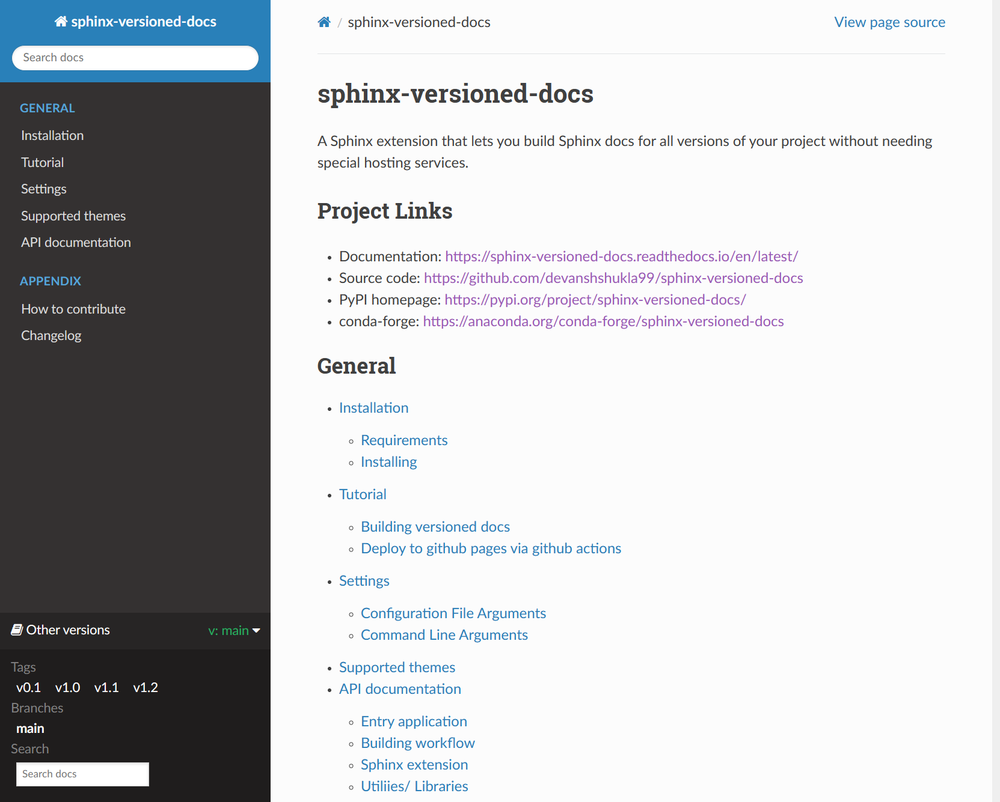

=====================
sphinx-versioned-docs
=====================

+-------------------------+-----------------------+
| |python-versions|       | |pypi-status|         |
+-------------------------+-----------------------+
| |build|                 | |docs|                |
+-------------------------+-----------------------+
| |license|               | |codestyle|           |
+-------------------------+-----------------------+
| |pypi-version|          | |pypi-downloads|      |
+-------------------------+-----------------------+
| |conda-version|         | |conda-downloads|     |
+-------------------------+-----------------------+

Sphinx extension that allows building versioned docs for self-hosting.
Supported on Linux and macOS.

It works by producing docs for all(specified) branches in separate folders and injects a readthedocs-like version selector menu/badge.

This project is a fork of `Smile-SA/sphinx-versions <https://github.com/Smile-SA/sphinx-versions>`_ with significant changes.

Get started using the `documentation`_

sphinx-versioned-docs in action!
--------------------------------

How to use
==========

.. code:: bash

    sphinx-versioned --help

.. code:: console

    Usage: sphinx-versioned [OPTIONS]

    ╭─ Options ─────────────────────────────────────────────────────────────────────────────────────────────────────────────────────────────────────────────────╮
    │ --chdir                                        TEXT  Make this the current working directory before running. [default: None]                              │
    │ --output                -O                     TEXT  Output directory [default: docs/_build]                                                              │
    │ --git-root                                     TEXT  Path to directory in the local repo. Default is CWD.                                                 │
    │ --local-conf                                   TEXT  Path to conf.py for sphinx-versions to read config from. [default: docs/conf.py]                     │
    │ --reset-intersphinx     -rI                          Reset intersphinx mapping; acts as a patch for issue #17                                             │
    │ --sphinx-compatibility  -Sc                          Adds compatibility for older sphinx versions by monkey patching certain functions.                   │
    │ --prebuild                    --no-prebuild          Disables the pre-builds; halves the runtime [default: prebuild]                                      │
    │ --branches              -b                     TEXT  Build docs for specific branches and tags [default: None]                                            │
    │ --main-branch           -m                     TEXT  Main branch to which the top-level `index.html` redirects to. Defaults to `main`. [default: None]    │
    │ --quite                       --no-quite             No output from `sphinx` [default: quite]                                                             │
    │ --verbose               -v                           Passed directly to sphinx. Specify more than once for more logging in sphinx.                        │
    │ --log                   -log                   TEXT  Provide logging level. Example --log debug, default=info [default: info]                             │
    │ --force                                              Force branch selection. Use this option to build detached head/commits. [Default: False]             │
    │ --help                                               Show this message and exit.                                                                          │
    ╰───────────────────────────────────────────────────────────────────────────────────────────────────────────────────────────────────────────────────────────╯

.. |python-versions| image:: https://img.shields.io/pypi/pyversions/sphinx-versioned-docs.svg?logo=python&logoColor=FBE072
    :target: https://pypi.org/project/sphinx-versioned-docs/
    :alt: Python versions supported

.. |pypi-status| image:: https://img.shields.io/pypi/status/sphinx-versioned-docs.svg
    :target: https://pypi.org/project/sphinx-versioned-docs/
    :alt: Package stability

.. |license| image:: https://img.shields.io/pypi/l/sphinx-versioned-docs 
    :target: https://pypi.org/project/sphinx-versioned-docs/
    :alt: License

.. |build| image:: https://github.com/devanshshukla99/sphinx-versioned-docs/actions/workflows/main.yml/badge.svg
    :alt: CI

.. |codestyle| image:: https://img.shields.io/badge/code%20style-black-000000.svg
   :target: https://github.com/psf/black

.. |docs| image:: https://readthedocs.org/projects/sphinx-versioned-docs/badge/?version=latest
    :target: https://sphinx-versioned-docs.readthedocs.io/en/latest/?badge=latest
    :alt: Documentation Status

.. |pypi-version| image:: https://img.shields.io/pypi/v/sphinx-versioned-docs
    :target: https://pypi.org/project/sphinx-versioned-docs/
    :alt: PyPI - Version

.. |conda-version| image:: https://anaconda.org/conda-forge/sphinx-versioned-docs/badges/version.svg
    :target: https://anaconda.org/conda-forge/sphinx-versioned-docs/
    :alt: Conda - Version

.. |pypi-downloads| image:: https://img.shields.io/pypi/dm/sphinx-versioned-docs
   :target: https://pypi.org/project/sphinx-versioned-docs/
   :alt: PyPI - Downloads

.. |conda-downloads| image:: https://anaconda.org/conda-forge/sphinx-versioned-docs/badges/downloads.svg
   :target: https://anaconda.org/conda-forge/sphinx-versioned-docs/
   :alt: Anaconda - Downloads

.. _documentation: https://sphinx-versioned-docs.readthedocs.io/en/latest/
